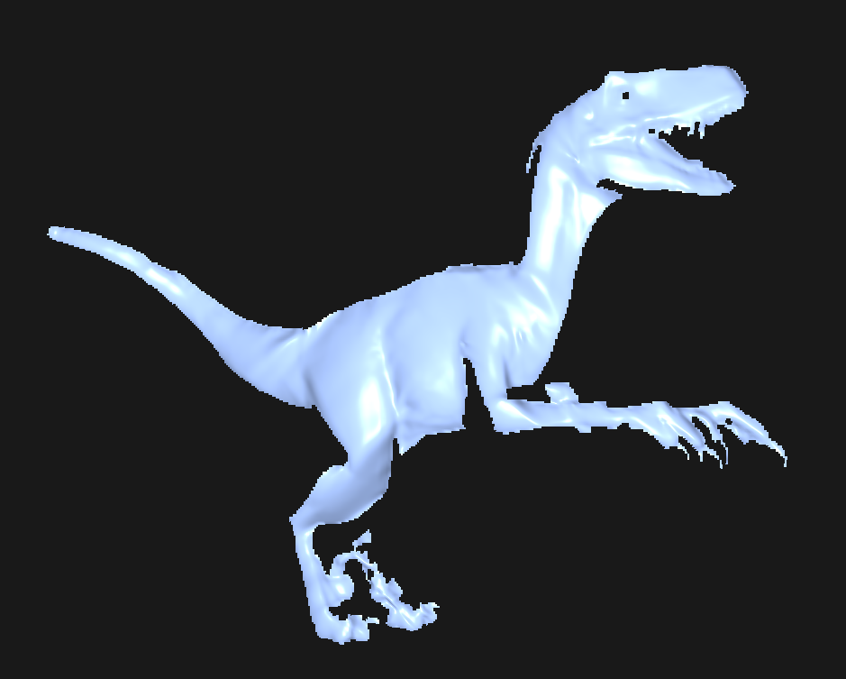
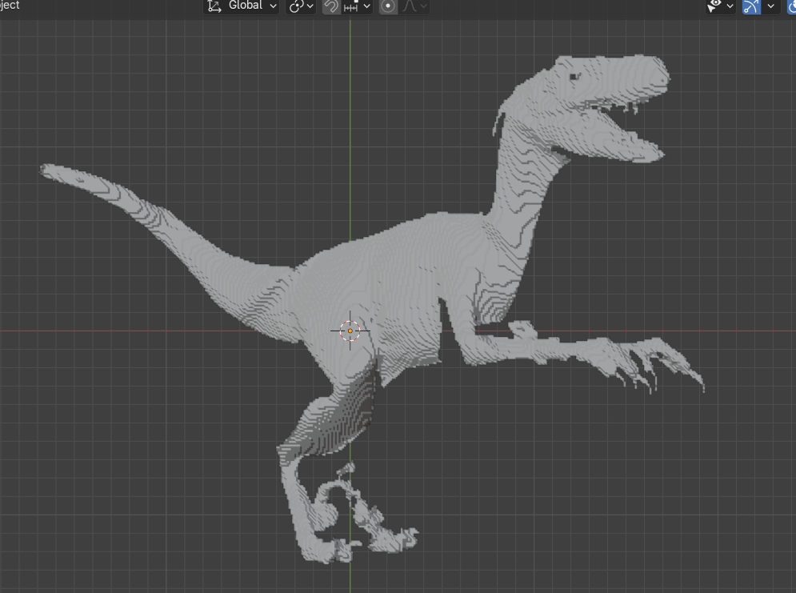

# Laba3

## Описание

Лабораторная работа по трёхмерной графике.

## Визуализация

### Программа

Выше представлена визуализация оболочки, отображённая в основной программе.

### Blender

Выше представлена визуализация той же модели в Blender.

## Технологии

- C#
- .NET
- OpenGL
- Visual Studio Code

## Результаты

В ходе данной лабораторной работы была успешно решена поставленная задача. Полученный исходный код реализует необходимые функциональные возможности и прошел проверку на корректность работы. Процесс решения включал изучение теоретических основ, разработку алгоритмов и их реализацию в коде. Итоговый результат соответствует поставленным целям и задачам.

